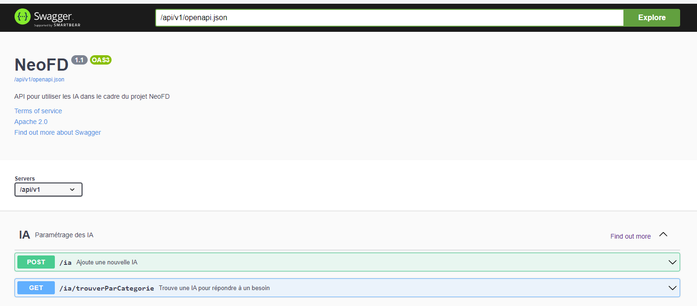
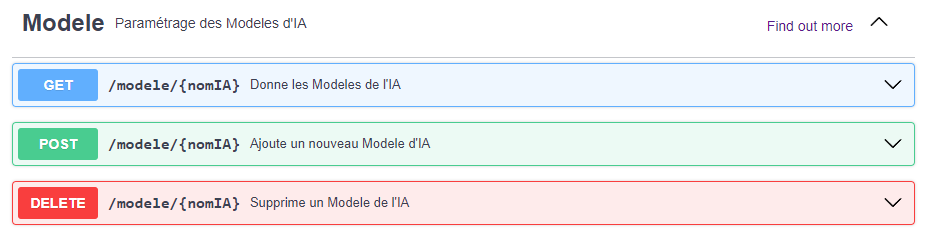
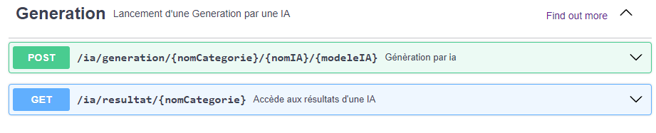

# Projet-Master





## Installation du projet

1. Windows

    1. Installation de git via https://gitforwindows.org/

    2. Installer les prérequis des IA
    ```commandline
    git clone https://github.com/Naejirah/NeoFD.git
    ./install_windows
    ``` 

## Lancement API

1. Windows
```commandline
.\apiEnv\Scripts\python -m swagger_server
``` 

Accessible via http://localhost:8080/api/v1/ui/
La liste des WS est disponible via l'API 

## Falcon

IA pour la génération de texte

1. Lancement
```commandline
IA\falcon\falconEnv\Scripts\python ./toolkit/txt2txt/falcon/inference.py
``` 
ou via l'appel WS

2. Résultat

Les résultats sont disponibles via ou via l'appel WS GET /ia/resultat/{nomCategorie}

## BLIP

IA pour la génération de texte à partir d'une image

1. Lancement
```commandline
IA\blip\blipEnv\Scripts\python ./toolkit/img2txt/blip/inference.py
``` 
ou via l'appel WS

2. Résultat

Les résultats sont disponibles via ou via l'appel WS GET /ia/resultat/{nomCategorie}


## Stable-diffusion

IA pour générer des images et améliorer des images
https://github.com/Stability-AI/stablediffusion?tab=readme-ov-file

1. Lancement
```commandline
IA\stable-diffusion\stable-diffusionEnv\Scripts\python .\toolkit\txt2img\stable-diffusion\inference.py --prompt "a professional photograph of an astronaut riding a horse" --ckpt "./IA/stable-diffusion/models/v2-1_768-ema-pruned.ckpt" --config IA/stable-diffusion/stablediffusion/configs/stable-diffusion/v2-inference-v.yaml --H 512 --W 512 --bf16 --device cuda
``` 
ou via l'appel WS

2. Résultat

Les résultats sont disponibles via ou via l'appel WS GET /ia/resultat/{nomCategorie}


## Liens importants :
<ul>
  <li>-Falcon 7b : https://huggingface.co/tiiuae/falcon-7b/tree/main</li>
  <li>-https://stablediffusionweb.com/</li>
  <li>-https://huggingface.co/</li>
  <li>-https://github.com/AUTOMATIC1111/stable-diffusion-webui</li>
</ul>